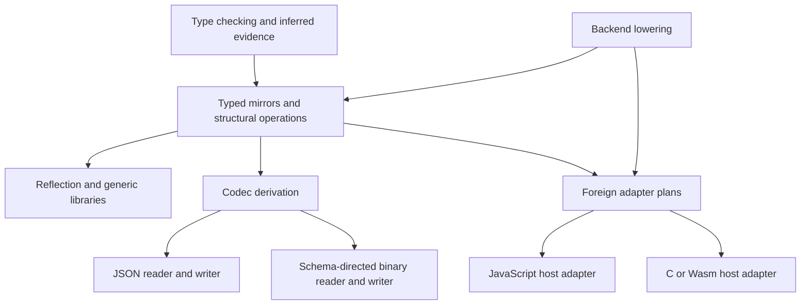

# Portable introspection, codecs, and foreign adaptation

Status: design agreed after review; implementation pending.

## Design

Make introspection a language facility built around **authenticated typed mirrors**. A mirror describes a Ruddy type and exposes safe structural operations on its values. Ordinary libraries use those operations to implement reflection, serialization, validation, and foreign data conversion. Foreign calling conventions remain explicit adapter contracts.

The compiler knows Ruddy types and representations. A codec knows a wire representation. A foreign adapter knows a host's values, storage, and invocation rules. None of these should define the other two.

This deliberately expands the scope of [inferred type representations](../inferred-type-representations/spec.md), including its earlier exclusion of public type representations and general type existentials. It preserves structural typing, terminating type checking, separate compilation, inferred evidence, and the selected [foreign trust policy](../region-mutability/ffi.md).

The `hide` forms below specify the selected source syntax. Other interface sketches use proposed pseudocode to describe intended typing and behavior. Neither the syntax nor the proposed functions have been implemented.

## Ordinary use

```ruddy
let config = { name: "Ruddy", retries: 3n, enabled: true }

let text = json::encode config
let bytes = cbor::encode config

let read_config:
  String -> Result { name: String, retries: Nat, enabled: Bool } json::Error =
  json::decode

let config_type = reflect::type_of config
let description = reflect::describe config_type
```

Encoding obtains its type from the argument. Decoding obtains its type from the expected result. An executed decode needs target-type evidence; it does not infer an application type by guessing from input data. A generic helper or partial application can retain that requirement until its caller supplies the type. Empty arrays work because the compiler supplies their element-type evidence.

Application policy is an ordinary value:

```text
json::encode_with config_encoder config
json::decode_with config_decoder text
cbor::encode_with config_encoder config
```

The same encoder can drive different format writers when they support its chosen representation. An application can independently select a decoder accepting older versions. No declaration annotation, global type-name registry, or nominal instance lookup is required.

## The separations that make this portable

| Facility | What it supplies | What it does not authorize |
| --- | --- | --- |
| `Description` | Ordinary, readable type-graph data | Casting, memory access, construction |
| `Mirror a` | Authentic evidence for the static type `a`; access to its supported typed operations | Choosing a JSON shape or a native ABI |
| Typed views and builders | Reading public immutable structure and constructing checked Ruddy values | Reading cells, executing functions, creating resources |
| `Encoder` / `Decoder` | A wire schema and the mapping between it and application values | Inferring foreign ownership or callback behavior |
| Foreign adapter | Host representation, calling convention, completion, ownership, declared effects | Proving that arbitrary foreign code honors its declaration |



Backend layout, semantic type identity, and wire-schema identity are separate. Changing a backend's record layout must not change JSON. Renaming a wire field must not change Ruddy type equality. A compiler node ID or type hash must not become an application protocol version.

## Portable primitive contracts

Portability requires explicit observable primitive semantics. `Nat` and `Int` have **target-chosen fixed precision measured in bits**, not arbitrary precision. Each target declares each primitive's value precision, signedness, and exact minimum and maximum. Storage size, pointer size, and foreign ABI integer width are separate properties; none implicitly determines the others. Signedness does not silently consume a bit from a precision shared between `Nat` and `Int`.

In particular, a JavaScript target can use `number` for both primitives with 53 bits of integer precision and the following safe-integer domains:

| Primitive | JavaScript domain | Meaning |
| --- | --- | --- |
| `Nat` | `0 .. 2^53 - 1` | Nonnegative safe integers |
| `Int` | `-(2^53 - 1) .. 2^53 - 1` | Signed safe integers |
| `Nat64` | `0 .. 2^64 - 1` | Fixed unsigned 64-bit integers on every target |
| `Int64` | `-2^63 .. 2^63 - 1` | Fixed signed 64-bit integers on every target |

The precision reported for target integers describes their supported integer values, not a required two's-complement encoding or a byte count. Fixed-width primitives retain their specified widths and domains. Targets using conventional 32- or 64-bit signed/unsigned domains are also supported; bounds are always explicit. Mirrors report both the original primitive kind and its effective domain, so `Nat` and `Nat64` remain different types even when their ranges coincide. Bounds metadata must itself be exact, for example validated decimal text or bytes, including when a bound cannot fit the inspecting target's `Nat` or `Int`.

Defined integer operations must produce exact in-domain results, regardless of internal representation. Target-integer overflow, integer division/remainder by zero, and out-of-domain ordinary partial numeric conversions have **undefined behavior**; their APIs do not gain `Result` returns. Existing specified behavior remains specified: saturating `Nat` subtraction, explicitly wrapping fixed-width operations, and IEEE floating arithmetic keep their contracts. Undefined cases are not promises of wrapping, trapping, or any particular host result. This rule does not license rounding a mathematically valid in-domain integer result. Checked codecs and FFI conversion interfaces instead return errors for out-of-domain external values. Invalid literals are diagnosed when the target domain is bound.

Integer types have one zero. A backend using floating-point storage must not expose a distinct negative integer zero through arithmetic, reflection, FFI, or integer-to-`Real` conversion; integer zero converts to positive Real zero. It may normalize its representation at any boundary that preserves these observations.

`Real` is IEEE binary64, with its arithmetic behavior, signed zero, infinities, and NaNs. Textual conversion policy is explicit in the codec section below; ordinary floating arithmetic is not changed by JSON's restrictions.

`String` is a sequence of valid Unicode scalar values. Length, character access, slicing, and search indices count scalars consistently: `"😀"` has length one. Ordering is lexicographic by scalar value; reversal, padding, and splitting use the same units. No operation silently normalizes text. Grapheme operations and byte encodings are separate APIs. A backend may store UTF-8 or UTF-16; scalar indexing is not promised to be constant time. Strict host ingress rejects malformed text unless an explicitly lossy conversion was selected. This applies to record keys and reflection/error metadata as well as payload strings. Raw operating-system values that are not Unicode use byte or opaque host APIs.

## 1. Typed mirrors

The central interfaces are:

```text
reflect::mirror   : () -> Mirror a
reflect::type_of  : a -> Mirror a
reflect::describe : Mirror a -> Description
reflect::shape    : Mirror a -> Shape a
```

`mirror` is a new compiler-supported operation. Its type parameter is inferred, and the compiler supplies a hidden mirror argument where required. `type_of` uses the static type at that occurrence; it does not discover a wider type by inspecting the runtime object.

`Mirror a` is opaque, authenticated, and invariant in `a`. Every admitted mirror carries complete exact semantic identity, even when its public shape is opaque. It is not an ordinary record users can forge or a covariant descriptor interchangeable across subtyping/coercion positions. Its implementation contains a finite semantic graph plus operations lowered for the chosen backend. A description copied from it is ordinary data and cannot be turned back into a witness by trusting its fields. If exact identity or its scope dependencies cannot be preserved, mirror construction is rejected; partial information is a `Description`, never a degraded `Mirror`.

Descriptions include numeric kinds, arrays, record and sum fields, recursive references, function arguments/results/effect rows, region and presence dependencies, and abstract/package positions. Alias spelling and source provenance can be optional diagnostic metadata; aliases retain structural identity. Compiler tooling can expose partial descriptions of unsolved schemes, but partial descriptions do not constitute exact runtime evidence.

Mirrors expose the structure that is justified by their evidence. An abstract package can have an authenticated enclosing mirror while its hidden representation remains sealed. `Mirror (hide 'a => Body 'a)` identifies the enclosing package type; it does not reveal the producer's chosen `'a`. Only an explicitly exposed authentic `Mirror 'a` grants inspection of that hidden choice. Describing a function or resource does not provide a data constructor for it.

Mirrors for the same static type in the same dependency scope have coherent structural capabilities. Acquiring another mirror cannot change whether a field is observable or constructible. Diagnostic metadata may differ; redaction and custom inspection policy belong in explicit descriptions or adapters, not competing implicit mirrors for the same type.

### Source syntax: `hide`

`hide` is an **unconditionally reserved keyword**, not a contextual keyword. The lexer recognizes it independently of the surrounding grammar. It cannot be used as an ordinary bare identifier, including an unquoted field name or a module-path segment. Quoted labels and string contents retain their existing lexical rules.

Reservation applies to the exact bare token: `hidden`, `hide_value`, and `Hide` remain identifiers. Existing sigilled tokens such as `'hide`, `#hide`, `!hide`, and `@hide` retain their lexical rules. Structural fields can still be written as `{ "hide": value }` and accessed as `record."hide"`; printers must quote that label. Binding/declaration names, module paths, and effect operation selectors have no quoted-name escape added by this change. For example, `!Effect.hide` is invalid. The Rust lexer/parser, Tree-sitter grammar, formatter, diagnostics, and highlighting must agree on the reserved word and new forms.

Use the same keyword in two forms:

```text
hidden-type    ::= "hide" type-variable "=>" type
hidden-pattern ::= "hide" type-variable pattern
```

The type form binds one ordinary type variable over its body. The body extends to the right; parentheses delimit a hidden type used as a type argument. Nested `hide` forms can bind additional hidden types. For example:

```ruddy
type Any = hide 'a => {
  mirror: reflect::Mirror 'a,
  value: 'a,
}
```

Each value has one particular type chosen by its producer. The enclosing `Any` type hides that choice while preserving the relationship between `mirror` and `value`. A consumer cannot instantiate the hidden type arbitrarily.

Construction uses ordinary expressions checked against an already-known hidden type:

```ruddy
let box: 'a -> Any = fn value => {
  mirror: reflect::type_of value,
  value: value,
}
```

The expected `Any` result tells the compiler to infer the hidden witness type, check the record against that instantiation, and introduce the package. The expected type can come from an annotation, a function parameter/result, or another checked surrounding context. The compiler does not invent hidden types for unconstrained expressions. No separate construction keyword or `hide expression` form is introduced.

Introduction applies only to an expression directly checked against a known hidden type. Contextual checking propagates to record and array literal elements, function-literal results, and individual match branches. Different branches checked against the same hidden result type may choose different witnesses. A known function parameter supplies its expected type while checking its argument. Already constructed arrays and functions are not implicitly mapped or wrapped to package their elements or results; the programmer writes that transformation explicitly. An already compatible package passes through unchanged, and the checker does not implicitly open a package to make it fit another package.

The witness must be resolved by the checked expression and its context. For example, checking a polymorphic identity function against `hide 'a => 'a -> 'a` cannot guess which type to hide; the producer supplies an annotation resolving it. No defaulting or fresh generalization chooses a witness. These are contextual introduction rules, not arbitrary deep coercions. Other expression forms can use an intermediate annotation when they do not propagate the needed context.

Opening uses a `hide` pattern in a match arm:

```ruddy
let describe_box: Any -> reflect::Description = fn boxed =>
  match boxed with
  | hide 'item { mirror, value } =>
    reflect::describe mirror
  end
```

The matched type must already be known to be a hidden type. The pattern introduces a fresh, rigid type named `'item` within that arm: `value` has type `'item`, and `mirror` has type `reflect::Mirror 'item`. Local type annotations refer to this same scoped type; it is not a freely generalizable variable. Payload patterns are checked against the opened body and cannot refine an unknown hidden type into a concrete type merely by matching a literal.

Initially, opening is available only in match arms, not in `let` patterns or function parameters. The fresh type cannot appear free in the arm's outward static type. Returning a description is valid; returning the bare hidden value is rejected. A closure may encapsulate hidden values and matching evidence without exposing that type in its signature, but its transitive region and presence-owner dependencies must remain tracked and valid. Repackaging under an expected hidden type is allowed under the same dependency rules. Hiding an ordinary type does not authorize hiding a region lifetime or discarding its ownership rules.

This lets the standard `Any` interface use the general package machinery. Mirrors and checked type equality remain compiler-supported. Merely hiding a type does not synthesize a mirror: the package above carries one explicitly. User-defined and compiler-provided packages follow the same evidence-opening rule below.

### Heterogeneous fields without erasing their types

The critical facility is a scoped package containing a field's hidden type together with operations using that same type:

```ruddy
type SomeField 'record = hide 'field => {
  name: String,
  mirror: Mirror 'field,
  presence: PresenceDescription,
  read: 'record -> Option 'field,
  bind: 'field -> Binding 'record,
}

type RecordView 'record = {
  fields: [SomeField 'record],
  build: [Binding 'record] -> Result 'record BuildError,
}

type SomeCase 'sum = hide 'payload => {
  name: String,
  mirror: Mirror 'payload,
  project: 'sum -> Option 'payload,
  inject: Option ('payload -> 'sum),
}

type ArrayView 'array = hide 'element => {
  element: Mirror 'element,
  read: 'array -> ['element],
  make: ['element] -> 'array,
}
```

Opening `SomeField 'record` with a `hide` pattern introduces one fresh, scoped type. The field mirror, observed value, decoder result, and `bind` input all use that type. A library can recursively decode the field and supply its result to `bind` without knowing the field's concrete type or performing a cast.

The evidence rule also covers inferred calls within that scope. An authentic `Mirror 'a` explicitly bound by a successful pattern supplies inferred evidence for that resolved hidden type. This applies equally to user-defined and compiler-provided packages. For example, `hide 'item { mirror, value }` binds evidence for `'item`; `hide 'item payload` binds no mirror and therefore supplies no such evidence. Field or variable spelling has no significance.

The rule follows explicit nested record/tuple patterns and selected option or sum payloads whose successful match establishes the mirror's availability. It does not search arrays or arbitrary values, invoke functions, read cells, implicitly open nested hidden packages, or search for lexical instances. A bound `Mirror ['a]` does not automatically supply `Mirror 'a`. Evidence is keyed by the actual scoped type identity and installed before checking or constructing closures in that arm. Generic calls forward it through the hidden calling convention; captured evidence retains its dependencies and cannot leak into other arms. Traversal may always pass a mirror to an explicit operation such as `derive mirror` instead.

For a required field, `read` always returns a value. Conditional fields may be absent; absence never fabricates a value of the hidden field type. Presence formulas and package ownership are checked separately from the field's payload.

A case exposes a total injector only when its admission is proved by the mirror's presence and ownership evidence. Otherwise `inject` is absent, or the position is descriptive only. A package-specific checked constructor can be added once its introduction rule is defined. Observability of a conditional sum case is not permission to introduce it unconditionally.

`Binding record` is an authenticated construction token, not a string paired with arbitrary bytes. It preserves its field identity, enclosing semantic type, and dependency scope. A builder rejects missing required fields, duplicates, foreign bindings, and invalid presence combinations. Bindings from separately acquired equivalent mirrors can interoperate when semantic field identity and scopes agree; allocation identity is not the rule.

Primitive shape cases supply typed conversions. For example, the `#String` case of `Shape a` contains `read: a -> String` and `make: String -> a`. This lets a library operate safely without making pattern matching refine `a = String`. General GADTs or public equality-proof elimination are unnecessary for this interface.

Generic derivation can therefore perform this algorithm entirely in Ruddy:

1. Inspect a mirror's shape.
2. For each record field, open its package and obtain the child decoder.
3. Read that field using its wire policy, retaining its actual type.
4. Convert the decoded value into a binding with the field's `bind` operation.
5. Ask the record builder to construct the typed result.

The same field operations support generic printers, validators, structural editors, diffs, schema tools, and test-data generators. A typed field lookup can return an optional field witness after checking both name and requested field type; arbitrary strings do not authorize typed access.

### Exact casts and dynamic reflection

Keep exact casts separate from conversion. `Any` packages retain an authentic mirror and the original payload. A checked downcast compares the complete semantic type contract and returns that payload unchanged. It does not perform numeric conversion, record projection, decoding, or host-shape validation.

Mirror equality returns typed identity functions on success:

```text
reflect::same : Mirror a -> Mirror b -> Option {
  forward: a -> b,
  backward: b -> a,
}
```

Equality follows Ruddy's structural type equivalence, including primitive kinds, effect contracts, and alpha-equivalent bound variables. Independently free region and owner identities are not alpha-renamed into equality. `Some` supplies an established equality and `None` an established inequality; `Any` downcasting consequently keeps its `Option` result. There is no unavailable-evidence case for a valid mirror. Unsupported comparison, a recovery placeholder, or exhausted implementation resources must never masquerade as inequality. Hashes are an optimization, never sufficient proof. Descriptive metadata alone must not make a cast available.

A dynamic inspector can open an appropriately scoped value package and use the same mirror operations. Unrestricted `Any` remains limited to payloads whose dependencies can safely be hidden. The proposal does not make every value unrestrictedly boxable.

## 2. Effects, regions, rows, and abstraction

Pure reflection observes immutable public structure. It never dereferences a cell, invokes a function, runs a host getter, or queries an operating-system resource. A cell or callable can appear as an opaque value with useful type metadata. Reading a cell requires its ordinary `!mut r` effect; invoking a function requires its actual callable contract and effects. A mirror supplies no handler.

A snapshot serializer is an explicit composition: an effectful application function produces immutable data, then a codec encodes that data. Reconstructing a resource is likewise an explicit application operation with its declared effects. A function identifier in a wire protocol denotes an application registry entry, not a reconstructed closure.

Mirrors, field packages, bindings, and closures retain transitive region and presence-owner dependencies. An exact type handle mentioning a free local region cannot escape merely because it contains no cell: exposing generative region identities would itself change observable isolation behavior. A freely exportable description instead abstracts such local identities.

The initial implementation must reject existential packaging whose hidden dependencies cannot yet be tracked safely. Describing the enclosing type and using ordinary typed operations within its valid scope remain possible. Full scoped value reflection requires dependency tracking through package opening, closure capture, generalization, storage, return positions, and artifacts. A phantom region parameter that loses additional captured regions is insufficient.

An open row obtains its actual remainder evidence from its caller. Reflection must not guess the remainder from a sample value. A producer-owned abstract remainder remains sealed unless the producer supplies operations or a codec under the package's abstraction.

Conditional presence is not independent wire optionality. If two fields share a presence condition, accepting either independently can construct an impossible value. Builders validate the joint presence formula. Until an ownership-preserving introduction rule exists for a package, automatic decoding of that package returns an explicit unsupported-shape error. Observing a present field does not reveal a hidden static witness.

Exact function descriptions include effects and relevant binders, not just input and result types. Hidden calling-convention dictionaries are implementation evidence, not new nominal type identity; packaging normalizes or captures their invocation convention. Callable reflection exposes neither closure environments nor a universal untyped `apply`. Invocation of a dynamically obtained function requires narrowing to an evidenced callable type, or a reviewed foreign contract, and carries the corresponding effects.

## 3. Inferred serialization and explicit codecs

The compiler synthesizes **mirrors**, not JSON serializers or arbitrary instances. Default structural derivation is an ordinary library operation:

```text
codec::derive : Mirror a -> Result (Codec a) DeriveError

Encoder a = {
  schema: EncodeSchema,
  run: a -> Result () Error + !Write,
}

Decoder a = {
  schema: DecodeSchema,
  run: () -> Result a Error + !Read,
}

Codec a = {
  encoder: Encoder a,
  decoder: Decoder a,
}
```

`Read` and `Write` are ordinary typed effect protocols defined by the codec library. JSON and binary format runners handle them. The same encoder can therefore write to a buffered string or an effectful byte sink without containing a rank-2 method or being parameterized by the writer's internal state. A buffered runner discharges the protocol purely; a streaming runner exposes its I/O effects. A generalized `Encoder a extraEffects` can retain additional application effects, but default structural codecs perform only their protocol effects. Snapshotting resources before encoding is usually the simpler application interface.

Derivation supports the immutable structural data universe: primitives, arrays, records, sums, and regular recursion. Functions, cells, resources, unrestricted `Any`, and inaccessible abstract structure are not automatically serializable. Derivation returns a typed error at the unsupported type position. Separate encoder and decoder derivation can expose capabilities independently when a representation is only observable or only constructible.

Default `json::encode` obtains the inferred mirror, derives or reuses its encoder, and runs the JSON writer. Default `json::decode` obtains the expected result mirror, derives or reuses its decoder, and runs the JSON reader. Their `Result` errors include derivation failure. Unsupported default serialization is a specified recoverable library failure, not a hidden compile-time instance constraint.

The compiler may optimize known successful derivations. It must not turn a deliberately handled derivation failure into an unconditional compilation error. Optional static diagnostics could explain a known failure without changing semantics. Explicit codecs bypass default derivation and need no mirror when their implementation already knows how to access and construct its values.

Failure to obtain valid exact, scoped mirror evidence is a compiler/evidence error. A valid mirror whose shape has no default codec instead produces an ordinary derivation error. These are different failures even when both can be detected while compiling a particular call.

Recursive type graphs require graph-aware derivation. First validate reachable nodes using a visited set; then return operations interpreting the mirror, or tie a checked lazy dictionary knot. Eagerly deriving every child before memoizing its parent loops on recursive types. Caching may share closed default policies; custom closures and environment-dependent policy must not be conflated by caching only a type hash.

### Dynamic values

`Any` is not automatically serializable. An explicit dynamic encoder may open its package, use the carried authentic mirror, and derive an encoder for the hidden payload; unsupported payloads still return a derivation error. This does not supply an inverse that can reconstruct the original static type from bare input. JSON `1`, for example, cannot establish whether the producer hid `Nat`, `Int`, or `Real`.

Recovering an `Any` with its original type identity requires a caller-selected codec registry and a schema-ID envelope. Registry entries carry the actual typed codecs and authentic mirrors needed to reconstruct their selected types. Wire descriptions and schema IDs alone cannot manufacture mirrors. A format-specific document type such as `json::Value` is the alternative when the application needs dynamic document data without preserving a Ruddy payload type.

### A protocol that works beyond JSON

The shared wire vocabulary includes exact signed/unsigned numbers, floating kinds, text, bytes, sequences, records, maps, tuples, variants, and explicit extension schemas. These are codec operations, not extra Ruddy semantic type constructors. A format can reject an unsupported representation or use an explicitly selected fallback.

Use concrete typed effect operations. The decoder owns typed recursion; the reader protocol never returns an arbitrary type variable:

```text
Read.read_bool    : () -> Result Bool Error
Read.read_nat64   : () -> Result Nat64 Error
Read.read_text    : () -> Result String Error
Read.begin_record: RecordSchema -> Result RecordCursor Error
Read.next_field  : RecordCursor -> Result (Option FieldKey) Error
Read.end_record  : RecordCursor -> Result () Error
... corresponding sequence, variant, numeric, and byte operations ...
```

The displayed operation declarations omit the enclosing `!Read` effect, which invoking an operation performs. After receiving a field key, the decoder selects the field's decoder and invokes it under the same format handler **before consuming the field's payload**. JSON supplies textual keys. A positional binary reader obtains field order and types from the supplied schema; it need not read names or type tags from the input. Typed scalar requests include exact range/representation information. `!Write` has corresponding operations with concrete arguments.

The handler owns parser/writer state; there is no mutable cursor hidden behind a supposedly pure function field. It maintains a checked session stack, with explicit start/end and expected-child transitions. Misordered custom calls return protocol errors. Cursor identities cannot authorize constructing values. Treat tokens as opaque paths/positions validated against the active stack, rather than new unrestricted generative identities. A stale token cannot bypass the current session's schema and ordering checks. The interface does not assume a new linear type system. A runner can thread immutable state or use validly isolated local mutation; neither exposes its parser state to the codec.

Successful completion requires the declared root and all session frames to be complete; a custom codec returning early is an error. Buffered JSON parsing/decoding consumes exactly one complete document and permits only JSON whitespace afterward. Incomplete input and trailing tokens are errors. Streaming framing is explicit and determines the input belonging to a session; it does not silently relax that session's completion checks.

This uses Ruddy's handlers to separate traversal from format interpretation and avoids rank-2 generic methods in records. Nested format runners install nested handlers, so a custom codec can perform an independent buffered conversion without advancing its outer stream. Each protocol label selects the active session; independently selectable simultaneous readers require explicit multiplexing/session arguments, not duplicate instances of the same effect label. No first-class suspended session is introduced here. Serde's distinction between type-directed requests and `deserialize_any` illustrates why a reader restricted to a universal dynamic value would exclude formats without type tags. [Serde deserialization design](https://serde.rs/impl-deserialize.html)

Skipping unknown binary data requires a wire length, wire kind, or source schema. Schema evolution may need both a source schema and a target decoder. Provide explicit protocol/version IDs or schema registries where necessary. A registry for wire versions is different from a global registry that silently selects behavior by a Ruddy alias name.

An optional format-specific document tree remains useful: `json::Value`, a CBOR document, an XML tree, or a database row. No common JSON-like tree is mandatory. A format with distinctions outside the shared vocabulary may expose a richer interface and explicit custom codecs; the common protocol does not promise universal lossless transcoding.

### Representation policy

Type structure alone cannot decide a useful external schema. Codec values select:

- Field names, accepted input aliases, stable numeric IDs/order, and schema-version conversions.
- Sum tagging, tuple layout, bytes representation, and explicit nullable conventions.
- Defaults, omitted fields, unknown fields, duplicate keys, and validation.
- Exact numeric/text representations and format extensions.

Ruddy's aliases do not become nominal through reflection. An alias named `Option`, `Date`, or `UserId` does not silently acquire special encoding. Tuples and unit reflect their actual structural record representation. `[Nat8]` becomes a byte string only under a selected bytes codec. Customization uses typed field witnesses or whole-value projections and checked reconstruction.

Provide ordinary projection, validation, record, sum, rename, default, and version-alternative combinators. An encoder can project an internal record into a public wire record; its paired decoder can validate and migrate that representation back. The same structural type can have several explicit codecs at different call sites.

The default strict structural JSON profile uses objects for records, arrays for arrays, and explicit `{ "tag": ..., "value": ... }` envelopes for sums. Unit encodes as `{}`; tuple records encode as objects with their numeric field labels. Options receive the ordinary sum representation, including `{}` for a unit payload. Typed decoding rejects unknown fields, duplicate fields, and missing required fields by default. Defaults, ignored unknown fields, accepted aliases, nullable options, tuple arrays, byte strings, dates, and resource references require selected codecs. A permissive policy must specify its conflict rules rather than silently imposing last-key-wins behavior. These are versioned library choices, independent of the JS ABI's superficially similar conventions.

Missing, JSON null, present unit, and an option's empty case are distinct. A nullable codec must define whether its mapping is reversible for its chosen payload type. A codec claiming a round trip cannot silently collapse distinguishable source values.

### Stable meaning and durable schemas

For a given schema and profile, default encoding promises stable wire meaning, not identical bytes. Applications needing hashes, signatures, or byte-for-byte reproducibility choose a named, versioned canonical profile. That profile specifies member ordering, whitespace, string escaping, and numeric spellings, including its signed-zero policy. Canonical ordering may require buffering and is subject to resource limits. Canonicalizing a JSON document may explicitly normalize numeric tokens; ordinary document stringification preserves them as described below.

Durable protocols use application-owned schema IDs and versions, stable field/case IDs, and explicit codecs. Source-schema information is supplied when a binary format needs it to interpret or skip older fields. Long-lived schemas deliberately choose fixed-width wire integers instead of inheriting an accidental target `Nat` or `Int` range. Default structural codecs work when both parties agree on the schema; editing the application type does not promise wire compatibility. Compiler type hashes, backend layouts, and source alias names do not become durable protocol identities or an implicit global codec registry.

### Numeric conversion and JSON documents

Keep primitive kinds, effective bounds, precision in bits, and signedness through reflection and numeric protocol operations. Parse JSON numbers as exact tokens until target conversion is checked. Integer decoding accepts any mathematically integral token in range, including `1.0` and `1e3`, without an intermediate floating conversion. Negative-zero tokens become integer zero. Range and work limits can be checked from token text without introducing arbitrary-precision language integers. JSON's interoperable numeric range is narrower than all integer tokens its grammar permits. [JSON specification, numbers](https://www.rfc-editor.org/rfc/rfc8259.html#section-6)

Default decimal-to-`Real` decoding uses correctly rounded binary64, round to nearest with ties to even. Values such as `0.1` are accepted even though binary64 cannot represent the decimal value exactly. The strict JSON profile rejects overflow, non-finite values, and a nonzero input that underflows to zero. Real encoding and decoding preserve negative zero. An exact-representability codec is an explicit alternative. NaN payload preservation needs a selected raw-bits representation; JSON's default profile does not encode NaNs or infinities. Encoding a finite `Real` emits a decimal that decodes to the same binary64 value under this policy.

Apart from explicitly selected conversion policies, including this default Real rounding rule, checked codecs reject range or precision loss. Checked foreign import/export follows its selected numeric representation and cannot recover precision already lost by the foreign producer. Export to a narrower host domain fails unless an explicit policy permits the conversion. These checks are independent of undefined ordinary arithmetic and the trust contract of raw extern calls.

The JSON document API preserves ordered object members, duplicate keys, and the **original valid numeric token spelling**. Replace `json::Value.#Number Real` with an exact token-based `Number` representation. Validated text is sufficient; this requires no arbitrary-precision primitive. Document stringification preserves member order, duplicates, and numeric spelling, and validates any user-constructed number token before emitting it. It does not promise to preserve whitespace or string-escape spelling. Conversions from a document number to integers or `Real` use the checked policies above. Duplicate-preserving document parsing and duplicate-rejecting typed decoding are intentionally different operations.

Document stringification writes a `json::Value` as a JSON document. Passing that same value to default structural `json::encode` follows the ordinary Ruddy sum/record representation; using the document representation requires the document API or an explicit document codec.

### Streaming, failure, and limits

Buffered helpers discharge format sessions and return no output on failure. Pure codecs make these helpers pure; a custom codec's additional effects remain visible and are **not rolled back** by discarding a buffer. Local parser state may use isolated mutation. Streaming readers and writers declare their I/O effects, support incremental traversal, and need no intermediate document tree. A custom decoder may reduce a sequence instead of allocating it. Own returned strings/bytes by default; a later borrowed interface must expose input-region dependencies.

A streaming failure may leave an output prefix or consumed input and ends that codec session. It does not promise rewind, atomic output, or closure of the underlying transport; transport lifetime is a separate contract. Configurable limits cover bytes, nesting, collection/member counts, numeric digits and exponent-related work, and schema traversal. Enforce limits before dangerous allocation or expansion, including for ignored input and canonical member sorting.

Errors distinguish parse, unsupported derivation, missing/duplicate/unknown field, unexpected case, range/precision, host observation, cycle, protocol misuse, and resource limit. Derivation errors carry **type paths**; value conversion errors carry **field/index/case paths**, with optional offsets and host causes. Messages are diagnostics, not the machine-readable contract.

The round-trip law applies to the codec's stated lossless domain: decoding an encoding recovers an equivalent immutable value. It does not promise pointer sharing or resource identity. Recursive types are finite graphs; runtime values can still contain cycles. Ordinary tree codecs reject active-path cycles and impose documented work/depth/size limits. Graph serialization needs explicit reference IDs and reconstruction policy; it cannot create arbitrary cyclic immutable values through a half-initialized record builder.

## 4. Foreign conversion and invocation

Foreign adapters consume mirrors where useful, but own their host contract. Use distinct opaque host types such as `js::Value`, native pointer/handle types, and Wasm resources. Do not simulate this distinction using structurally identical aliases or a forgeable string tag. A compiler backend and a foreign environment are separate choices: a native backend might embed JS, and a Wasm backend can expose several host protocols.

An explicit data adapter has a shape like:

```text
ForeignAdapter a foreign effects = {
  lower: a -> Result foreign ConversionError + effects,
  lift: foreign -> Result a ConversionError + effects,
}
```

Adapter factories use inferred mirrors for default structural conversion. Specialized adapters are ordinary explicit values. Internally an extern also has a reviewed ABI plan covering layout and calls; source records describing that plan are not proof of safe invocation or witness authenticity.

| Adapter | Additional contract beyond a Ruddy type |
| --- | --- |
| JavaScript | Arrays/objects/tagged values, property observation, numeric conversion, callback completion |
| C ABI | Size/alignment, integer widths, string encoding, pointer validity and lengths, allocation/free, calling convention |
| Wasm component ABI | Lifting/lowering, linear-memory layout, resource handles, ownership and canonical call rules |

Wasm's canonical ABI is useful prior art for keeping lifting/lowering rules distinct from interface type descriptions. It is an external ABI to implement, not the definition of Ruddy's internal layout. [Canonical ABI specification](https://github.com/WebAssembly/component-model/blob/main/design/mvp/CanonicalABI.md)

Checked data conversion returns recoverable errors when input values violate the selected representation. A declared extern trusts the foreign implementation's behavioral contract; malformed results there remain foreign contract failures unless the declaration explicitly selects a checked conversion interface. A type witness cannot make dereferencing an arbitrary C pointer safe. Validity, length, lifetime, and allocation provenance must be supplied by the adapter contract.

Host observation can perform effects. Reading a JS property can invoke a getter/proxy, so arbitrary foreign-object inspection belongs in an effectful host adapter. Pure JSON parsing starts from inert text/bytes and is independent of that adapter. A trusted inert-data snapshot can subsequently be decoded purely. Importing or exporting persistent arrays takes snapshots as required; forwarding an opaque foreign value preserves its host identity.

Callbacks require the complete per-arrow function type and reviewed invocation evidence: argument/result conversion, effects and handler evidence, currying, sync/async completion, and retained state. Merely checking that a host value is callable cannot establish a pure Ruddy function contract. Data decoders reject callable reconstruction; explicit extern/callback adapters handle it. Completion timing does not supply permission for additional effects.

Preserve the existing [selected foreign trust policy](../region-mutability/ffi.md): foreign code and callers are trusted to respect lifetime, retention, thread, allocation, storage identity, and declared effects. This proposal adds no mandatory revocation tokens, scoped-only callback restriction, or FFI lifetime/thread guards. Ordinary Ruddy escape/effect checking remains. Any enforcement required by a particular external ABI belongs to that adapter.

The first implementation includes working JavaScript incoming/outgoing conversion and callbacks. Backend-neutral ABI plans are validated against representative C and Wasm layouts and invocation contracts. Production native/Wasm foreign integration is later work; a validated plan is not a claim that those integrations already execute.

## 5. Compiler implementation and termination

Keep ordinary values untagged unless their existing representation needs a tag. Emit mirrors and operations only when introspection, boxing, or an adapter demands them. Generic functions receive hidden mirror evidence; wrappers forward it, closures capture it, and partial application places it at the correct arrow. Reflecting a type never requires inspecting an example value to recover erased parameters.

Retain the finite demand-solving architecture in [conventions.rs](../../src/reification/conventions.rs), but broaden its evidence vocabulary. Its current callable skeleton deliberately skips effect and region edges, and [interface validation](../../src/reification/interface.rs) excludes presence parameters from ordinary descriptor demands. Exact mirrors need kinded slots for the type, row, effect, presence, and region facts they actually expose, plus scoped identities for freshly opened types. Reusing the current data-conversion ports unchanged would lose necessary evidence.

The carrier remains finite: compiler-defined evidence kinds over finite lexical binders and callable ports. Solving propagates those dependencies rather than repeatedly expanding instantiated types or generating new binders in the solver. Runtime opening instantiates the already-checked package convention. Annotated polymorphic recursion is already supported and is appropriate for mirror traversal; see [the reification test](../../tests/src/compile.rs) covering recursively changing instantiations.

Do not add arbitrary user code execution, recursive instance search, or format-specific rules to type checking. Derivation executes as ordinary library code. Semantic graphs and structural operations are finite; recursive groups allocate graph/dictionary identities before connecting edges. Exact equality memoizes graph-node pairs and respects binder scopes. No eager recursive alias unfolding or whole-program monomorphization is required.

Portable artifacts publish semantic graphs, operation templates, scope dependencies, inferred requirements, and reviewed callable conventions. Import validation checks references, binders, field ownership, constructor availability, and evidence layouts. Version artifact schemas and caches when these conventions change. Backend lowering translates semantic operations into its own record/array/sum layout and host adapters into its own calling operations.

The compiler's target description fixes `Nat` and `Int` domains for the whole linked program and propagates them to dependencies. Node versus Web host selection does not independently change these domains. Portable artifacts retain symbolic target primitives until binding them once to a target; specialized artifacts record their concrete domains. Linking rejects incompatible specializations, and compilation/derivation caches include the bound domains. Target binding validates literals before execution. Array-index and host-size bridges validate their representation limits without equating pointer width or a foreign ABI width with Ruddy integer precision.

The actual new compiler/language work is:

1. Opaque invariant `Mirror a`, typed construction tokens, exact witness comparison, and compiler-derived observe/build operations.
2. The reserved `hide` keyword, hidden-type syntax, expected-type-directed implicit package introduction, and scoped opening through match patterns, with skolem escape checks. Contextual checking must reach literal children, function results, individual match branches, and arguments of known function types. Today's presence packages are not this facility.
3. Transitive region/presence dependency preservation for accepted packages and mirrors; conservative rejection until each case is supported.
4. Broader semantic descriptors, separate from native conversion plans, including faithful effect/callable descriptions.
5. Evidence, artifact, and backend integration, including the same explicit pattern-bound mirror rule for user and compiler packages, installed before arm closure construction.
6. Compiler-owned opaque host-type identities, initially for JS values, with distinct identities available to native/Wasm handle adapters as those integrations are implemented. Today's single `ForeignValue` cannot express distinct environments using aliases alone. This limited extension does not make ordinary user aliases nominal or introduce instance lookup.
7. Target integer-domain binding, exact domain metadata, artifact/cache compatibility checks, and portable scalar-text and numeric semantics.

Typed shape accessors avoid general GADTs. Concrete operations and existing effect handlers avoid rank-2 protocol fields. Existing annotated polymorphic recursion avoids needing its unrestricted inference. Nominal traits, overlapping instances, higher-kinded types, macros, and explicit type arguments are not prerequisites.

Backend optimizations may specialize mirrors, inline traversals, remove binding allocations, and generate fast codec loops. These optimize one semantics; they do not introduce a separate serializer implementation with different policies or error behavior.

## Alternatives considered

| Design | Strength | Limitation | Decision |
| --- | --- | --- | --- |
| Compiler-derived operations with checked dynamic child packages | Smallest type-system change; sufficient for codecs and dynamic inspectors | Libraries cannot use a discovered field type as a fresh static type | Considered alternative; insufficient for the selected interface |
| Serializer/visitor protocols as the main facility | Strong format independence and streaming | Still needs a separate reflection facility and foreign ABI contracts; naive signatures hide rank-2 requirements | Use concrete typed effect protocols at the codec seam |
| Typed mirrors with scoped field packages | Supports typed user-written generic libraries, safe construction, and reusable reflection | Requires real existential and scope-checking work | Selected foundation |

The selected design accepts the larger compiler cost to provide typed reflection and reusable generic libraries. A dynamic-only intermediate implementation does not satisfy its acceptance criteria.

Scala's compiler-supplied mirrors and library derivation illustrate separating structural evidence from behavior. Haskell's typed representations illustrate the distinction between a runtime description and evidence sufficient for a cast. Ruddy should borrow that separation while retaining its own structural identity and inference rules. [Scala derivation](https://docs.scala-lang.org/scala3/reference/contextual/derivation.html), [Haskell Type.Reflection](https://hackage-content.haskell.org/package/base-4.19.2.0/docs/Type-Reflection.html)

The independent explorations are recorded in [typed mirrors](typed-mirrors.md), [protocols](protocols.md), and [derived operations](derived-operations.md). This document selects among them; their alternative interfaces are not additional simultaneous requirements.

## Implementation and acceptance

1. **Specify and implement primitive contracts.** Bind target integer precision and exact domains, retain the specified undefined ordinary numeric cases, and implement scalar-based string operations and strict text ingress. Give semantic primitive operations a portable implementation contract distinct from JS extern source strings.
2. **Separate semantic evidence from host plans.** Move JS direction/layout details out of semantic reification. Preserve exact cast behavior and per-arrow evidence while extending identity to all admitted mirror contracts.
3. **Implement typed introspection.** Add reserved `hide`, contextual package construction, mirrors, field/case/array operations, checked builders, scoped packages, and the general pattern-bound evidence rule. Track dependencies or reject unsupported cases. Expose descriptive opaque positions without pretending they are constructible.
4. **Implement codecs as portable libraries.** Add explicit encoder/decoder values and inferred defaults. Implement JSON plus a positional/schema-directed binary format through the same typed effect protocol. Implement strict typed decoding and a separate document API preserving ordered duplicates and exact number tokens. Include explicit policies for canonical output, dynamic values, and durable schemas.
5. **Implement JavaScript foreign adapters.** Deliver checked incoming/outgoing conversion and callbacks, preserving declared effects, completion, extern failures, and the selected trusted lifetime contract. Validate backend-neutral C/Wasm ABI plans with representative layouts and calls; actual native/Wasm integrations are subsequent work.
6. **Prove backend independence.** Run the same Ruddy reflection and codec source programs through JS and an independent executable reference interpreter using a different internal value representation. The interpreter executes the shared portable program/IR and primitive contracts; recognizing JS extern strings or reimplementing codecs by hand is not sufficient. Exercise conventional 32- and 64-bit target-integer domains and the JS 53-bit safe domains. A production native backend is not required initially.

These APIs have not shipped. There is no migration-documentation or compatibility-wrapper requirement for their existing experimental forms. Future schema-version conversion is an application protocol feature, independent of preserving those forms.

The current implementation offers useful foundations, not a complete introspection interface. [reification.rs](../../src/reification.rs) has finite descriptors, but its arrow descriptors omit effects and their exact policy rejects effectful arrows. `NativeTemplate` overlays optional foreign fields. [type-runtime.js](../../src/backend/type-runtime.js) performs host-specific access/conversion. [json.rud](../../std/json.rud) currently routes typed decode through raw foreign values and `ffi::decode`. This proposal replaces that route with a portable reader plus typed construction while retaining the valuable inference and calling-convention machinery.

Acceptance must cover:

- Lexing `hide` as reserved regardless of context in both Rust and Tree-sitter; parsing, formatting, diagnostics, and highlighting. Quoted labels, sigilled tokens, and longer/case-distinct identifiers retain their rules; printers quote `"hide"` as a structural field label.
- Contextual package introduction through literal elements, known function parameters/results, and match branches choosing different witnesses. Reject unresolved witnesses and unsupported opening positions; do not silently transform existing arrays/functions or open packages to coerce them.
- Package abstraction: an enclosing mirror does not reveal a hidden witness. Equivalent explicitly bound mirrors from user and compiler packages provide the same branch-local evidence; ignored mirrors, whole-payload bindings, and unopened nested packages do not. Check evidence before arm closure construction and preserve captured dependencies.
- Inferred encode/decode through higher-order functions, partial application, returned closures, annotated recursion, and separately compiled imports; no target guessing for empty values. User-written traversal and checked heterogeneous reconstruction require no compiler format cases.
- Exact structural casts across aliases, distinct primitive kinds, complete effect contracts, alpha-equivalent bound types, and distinct free owners. Reject forged/mismatched bindings and unsafe skolem/region/presence escapes. Invalid evidence never becomes a partial mirror or an equality answer.
- Joint conditional presences, sealed packages, regular recursive graphs, and recoverable unsupported derivation errors. A deliberately handled unsupported default codec still compiles; an explicit codec can bypass derivation.
- Exact target-domain metadata and boundary values under unsigned/signed 32- and 64-bit configurations and the JS 53-bit safe domains. Defined shared-domain operations agree, including a single integer zero; tests impose no result on undefined ordinary arithmetic/conversions. Check existing saturating and wrapping contracts separately.
- Decode `4294967296` as `Nat`: range error under unsigned 32-bit, success under unsigned 64-bit and JS 53-bit domains. Decode as `Nat64` successfully on all three, including exact 64-bit extremes elsewhere; exact casts never conflate `Nat` and `Nat64`. Diagnose out-of-domain literals and reject incompatible specialized artifacts/caches.
- Scalar text length, slicing, search, ordering, reversal, and malformed host ingress, including astral scalars, keys, and metadata; no automatic normalization. Test host/index representation boundaries without assuming a common machine or ABI width.
- Integer decoding of integral fraction/exponent spellings, checked range failures, correctly rounded `Real` including `0.1`, ties, subnormals, negative zero, overflow, and nonzero underflow to zero. Default JSON rejects non-finite values; exact-representability and raw-bit codecs have their stated distinct policies.
- Ordered duplicate-preserving document parsing, numeric token spelling preservation, invalid constructed token rejection, and explicit number conversions. Strict typed decoding rejects duplicate/unknown/missing required fields and preserves unit, numeric-label tuple, tagged option, missing, and null distinctions.
- Stable wire meaning under default profiles, reproducible bytes under named canonical profiles, explicit durable schema/version IDs, and selected fixed-width wire domains. Dynamic encoding requires an explicit API; reconstructing an original `Any` uses a caller-selected registry and schema envelope.
- One explicit codec with both text and positional binary writers; decoding without runtime type tags; explicit source-schema/version decoding; streaming reduction without a document tree. Nested handlers isolate sessions; misordered/stale protocol calls and incomplete roots fail. Buffered JSON rejects trailing tokens and incomplete input.
- Buffered failure returns no output without rolling back custom effects; streaming failure ends its session and may leave consumed input/output. Exercise byte/depth/count/numeric-work/schema limits before allocation, canonical buffering limits, owned return data, cycle rejection, and explicit graph policies.
- Both JS FFI directions, snapshots, opaque identity, declared callback effects/completion, strict checked numeric/text conversion, and host-observation failures. Validate C/Wasm plans without claiming executable integrations.
- Equivalent declared behavior across JS and the independent interpreter running the same library programs. Reject malformed artifacts, including invalid identity/scope evidence, and invalidate caches when domains or inferred evidence change.

These are future implementation checks. This change records the agreed design only; it does not claim those features or tests have been implemented. Run Rust tests through `just test` when implementation begins.
